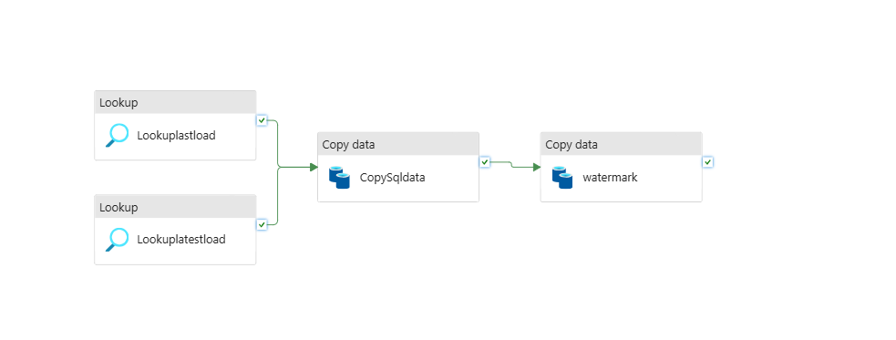

# Azure Data Factory End-to-End Data Pipeline

## Project Overview

This project demonstrates an **end-to-end data engineering pipeline built using Azure Data Factory (ADF)**.
The pipeline ingests both **structured (CSV)** and **semi-structured (JSON)** datasets, performs transformations, and loads the processed data into analytical tables.

The project implements several **industry-grade data engineering concepts**, including:

* Parameterized pipelines
* Metadata-driven pipeline orchestration
* Incremental loading using watermarking
* Hybrid data integration using On-Prem Integration Runtime
* JSON and CSV data ingestion
* SQL-based transformations
* ARM template-based infrastructure deployment

The pipeline processes airline-related datasets such as **Airlines, Airports, Flights, and Passengers** and loads them into a structured dimensional model.

---

# Architecture

## Pipeline Execution Flow


The pipeline orchestrates ingestion, transformation, and loading processes using Azure Data Factory activities.

---

## Data Flow Architecture


Data flows from source files through staging and transformation layers before being loaded into analytical tables.

---

## Incremental Loading using Watermark



The pipeline implements **watermark-based incremental loading** to ensure only new or updated data is processed during each run.

---

# Key Features Implemented

## Parameterized Pipelines

Pipelines are designed using **dynamic parameters** so the same pipeline can process multiple datasets.

Examples of parameters:

* Source file name
* Destination table
* Dataset path
* Load type

Benefits:

* Reusable pipelines
* Reduced duplication
* Flexible execution

---

## Metadata Driven Pipeline

Instead of hardcoding ingestion logic, the pipeline uses **metadata configuration** to dynamically control pipeline execution.

Metadata contains:

* Source dataset
* Target table
* File format
* Load type

Advantages:

* Easy onboarding of new datasets
* Dynamic pipeline behavior
* Minimal pipeline modification

---

## Data Ingestion

Data is ingested using **Azure Data Factory Copy Activity**.

Supported formats:

* CSV
* JSON

Example source datasets:

* `DimAirline.csv`
* `DimAirport.json`
* `DimFlight.csv`
* `DimPassenger.csv`

These datasets represent **dimension tables** used in the analytical model.

---

## Incremental Loading Strategy

The pipeline uses **watermarking** to implement incremental data ingestion.

Workflow:

1. Store the **last processed timestamp**
2. Extract records **greater than the watermark value**
3. Process only new records
4. Update watermark after pipeline completion

Advantages:

* Reduced processing time
* Efficient large-scale ingestion
* Avoids duplicate processing

---

## Data Transformations

Transformations are performed using **SQL scripts**.

Example:

```
fact_bookings_full.sql
```

Transformations include:

* Fact table creation
* Data normalization
* Data filtering
* Data quality checks

---

## Hybrid Data Integration

The project uses **Self Hosted Integration Runtime** to connect Azure Data Factory with **on-premise data sources**.

Benefits:

* Secure on-prem connectivity
* Hybrid cloud architecture
* Scalable data ingestion

---

# Infrastructure as Code

The project includes **Azure Resource Manager (ARM) templates** for deployment.

Located in:

```
ARM/
```

Example files:

* `ARMTemplate_master.json`
* `ARMTemplateForFactory.json`
* `ARMTemplateParameters_master.json`
* `ADFPROJECTAMAN_GlobalParameters.json`

These templates allow the **ADF environment to be recreated automatically**.

---

# Project Structure

```
ADFPROJECT
│
├── ARM
│   ├── ARMTemplate_master.json
│   ├── ARMTemplateForFactory.json
│   ├── ARMTemplateParameters_master.json
│   └── ADFPROJECTAMAN_GlobalParameters.json
│
├── Images
│   ├── Data flow.png
│   ├── Execution pipeline.png
│   └── watermarking.png
│
├── DimAirline.csv
├── DimAirport.json
├── DimFlight.csv
├── DimPassenger.csv
│
├── fact_bookings_full.sql
├── empty.json
└── On-Prem Linked Service Error.txt
```

---

# Data Model

The project follows a **dimensional data model**.

### Dimension Tables

* DimAirline
* DimAirport
* DimPassenger
* DimFlight

### Fact Table

* FactBookings

This structure supports **analytical queries and reporting workloads**.

---

# Technologies Used

* Azure Data Factory
* Azure Resource Manager (ARM Templates)
* SQL
* CSV Data Processing
* JSON Data Processing
* Self Hosted Integration Runtime

---

# Data Engineering Concepts Demonstrated

This project demonstrates several **core data engineering practices**:

* ETL pipeline design
* Metadata-driven architecture
* Incremental loading
* Watermark strategy
* Hybrid data integration
* Parameterized pipelines
* Infrastructure as Code
* Dimensional data modeling

---

# Future Improvements

Possible enhancements include:

* Pipeline monitoring and alerting
* Data quality validation layer
* Integration with BI tools (Power BI)
* Automated schema evolution handling

